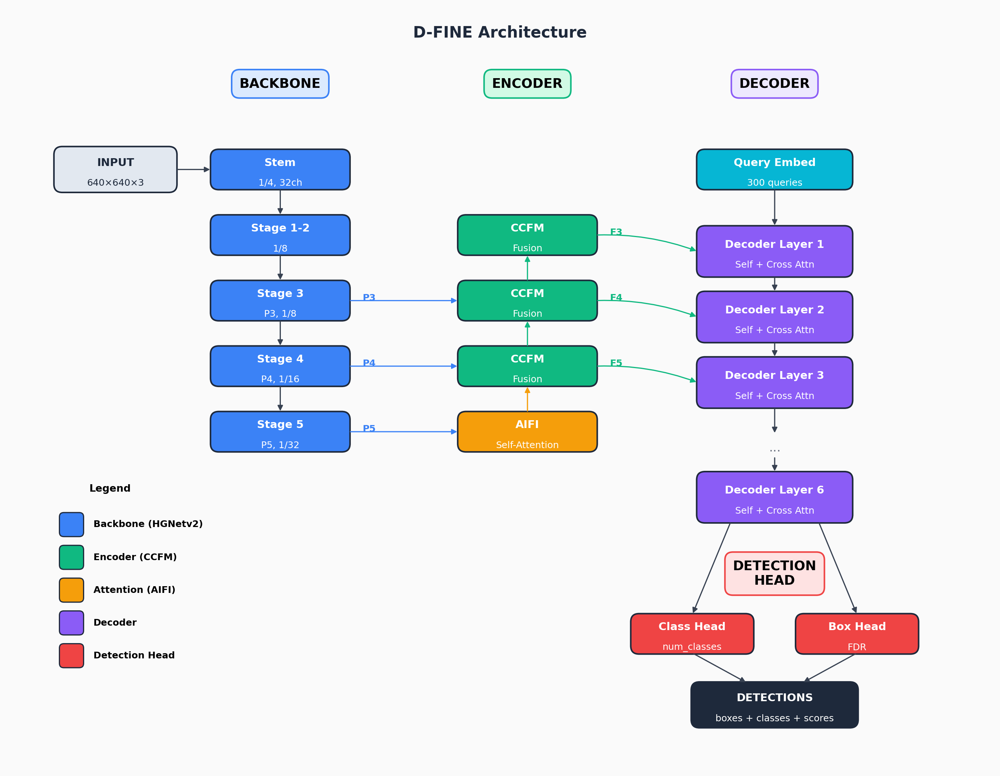

# D-FINE Architecture Summary

D-FINE (Fine-grained Distribution refinement DETR) builds on RT-DETR with improved localization via distribution-based box prediction.

---

## High-Level Architecture

```
Image → HGNetv2 Backbone → Hybrid Encoder (CCFM + AIFI) → Transformer Decoder → Detection Head
                                                                              ↓
                                                            Fine-grained Distribution Refinement (FDR)
```

| Component | Description |
|:----------|:------------|
| **Backbone** | HGNetv2 - Hierarchical feature extraction (P3, P4, P5) |
| **Encoder** | CCFM + AIFI - Cross-scale fusion and intra-scale attention |
| **Decoder** | Transformer decoder with deformable cross-attention |
| **Head** | Iterative box refinement with distribution-based prediction |

---

## Module Classes and Locations

> Modules are located in `D-FINE/src/` directory.

| Module | File | Description |
|:-------|:-----|:------------|
| `HGNetv2` | `zoo/dfine/hgnetv2.py` | Backbone network |
| `HybridEncoder` | `zoo/dfine/hybrid_encoder.py` | CCFM + AIFI encoder |
| `AIFI` | `zoo/dfine/hybrid_encoder.py` | Attention-based Intra-scale Feature Interaction |
| `TransformerDecoderLayer` | `zoo/dfine/deformable_transformer.py` | Decoder layer with deformable attention |
| `DFINETransformer` | `zoo/dfine/dfine_decoder.py` | Full decoder with iterative refinement |
| `MLP` | `nn/backbone/common.py` | Multi-layer perceptron for heads |
| `MSDeformableAttention` | `nn/layers/deformable_attention.py` | Multi-scale deformable attention |

---

## Model Variants

| Variant | Backbone | Input Size | Parameters | AP (COCO) |
|:--------|:---------|:-----------|:-----------|:----------|
| **D-FINE-N** | HGNetv2-N | 640×640 | 4M | 42.8 |
| **D-FINE-S** | HGNetv2-S | 640×640 | 10M | 48.5 |
| **D-FINE-M** | HGNetv2-M | 640×640 | 19M | 52.3 |
| **D-FINE-L** | HGNetv2-L | 640×640 | 31M | 54.0 |
| **D-FINE-X** | HGNetv2-X | 640×640 | 62M | 55.8 |

---

## Backbone: HGNetv2

HGNetv2 (High-Performance GPU Network v2) is an efficient backbone optimized for GPU inference.

### Overall Structure

```
Input → Stem → Stage1 → Stage2 → Stage3 → Stage4 → Stage5
                                    ↓        ↓        ↓
                                   P3       P4       P5
                                  (1/8)   (1/16)   (1/32)
```

### Stage Details (HGNetv2-S)

| Stage | Output | Channels | Blocks | Description |
|:-----:|:------:|:--------:|:------:|:------------|
| Stem | 1/4 | 32 | - | Conv3×3 s=2 → Conv3×3 s=1 → Conv3×3 s=2 |
| Stage1 | 1/4 | 48 | 1 | HG Block |
| Stage2 | 1/8 | 96 | 1 | HG Block (downsample) |
| Stage3 | 1/8 | 192 | 3 | HG Block × 3 → **P3 output** |
| Stage4 | 1/16 | 384 | 1 | HG Block (downsample) → **P4 output** |
| Stage5 | 1/32 | 768 | 3 | HG Block × 3 → **P5 output** |

### HG Block (High-Performance GPU Block)

```
Input → LightConv → LightConv → ... → LightConv → Concat all → Conv1×1 → Output
   ↓        ↓           ↓                 ↓                        ↑
   └────────┴───────────┴─────────────────┴────────────────────────┘
                    (Dense connections)
```

| Component | Description |
|:----------|:------------|
| **LightConv** | Depthwise-separable convolution: DWConv3×3 → Conv1×1 |
| **Dense Connections** | All intermediate features concatenated |
| **Aggregation** | 1×1 conv to reduce concatenated channels |

---

## Encoder: Hybrid Encoder (CCFM + AIFI)

The encoder fuses multi-scale features and applies intra-scale attention.

### CCFM (Cross-scale Context Fusion Module)

```
P3 ──────────────────────────────────────────────→ F3
 ↓ downsample                                       ↑
P4 ────────────────────→ Fusion ──────────────────→ F4
 ↓ downsample              ↑                        ↑
P5 ──→ AIFI ──→ Fusion ───┴───→ Fusion ───────────→ F5
```

Features are fused bidirectionally:
1. **Top-down**: P5 → P4 → P3 (semantic information flows down)
2. **Bottom-up**: P3 → P4 → P5 (spatial details flow up)

### AIFI (Attention-based Intra-scale Feature Interaction)

Applied to the highest-level features (P5) for global context:

```
P5 → Flatten → Multi-Head Self-Attention → Reshape → F5
              (with positional encoding)
```

| Parameter | Description | Default |
|:----------|:------------|:--------|
| `embed_dim` | Feature dimension | 256 |
| `num_heads` | Attention heads | 8 |
| `feedforward_dim` | FFN hidden dim | 1024 |

---

## Decoder: D-FINE Transformer Decoder

The decoder refines object queries through multiple layers with deformable attention.

### Decoder Overview

```
Encoder Features (F3, F4, F5)
          ↓
     Reference Points ← Query Embed
          ↓
┌─────────────────────────────────┐
│   Decoder Layer 1               │
│   ├─ Self-Attention             │
│   ├─ Deformable Cross-Attention │
│   └─ FFN                        │
├─────────────────────────────────┤
│   Decoder Layer 2               │
│   ...                           │
├─────────────────────────────────┤
│   Decoder Layer N (default: 6)  │
└─────────────────────────────────┘
          ↓
     Detection Head
```

### Decoder Layer

| Component | Description |
|:----------|:------------|
| **Self-Attention** | Queries attend to each other |
| **Deformable Cross-Attention** | Queries attend to encoder features via learned sampling points |
| **FFN** | 2-layer MLP with ReLU |

### Multi-Scale Deformable Attention

Instead of attending to all spatial locations, deformable attention samples from learned offsets:

```
Query → Linear → Sampling Offsets (K points per level)
     → Linear → Attention Weights

For each scale (F3, F4, F5):
    Sample K points around reference point
    Weight and aggregate sampled features
```

| Parameter | Description | Default |
|:----------|:------------|:--------|
| `num_levels` | Number of feature scales | 3 |
| `num_points` | Sampling points per level | 4 |
| `num_heads` | Attention heads | 8 |

> **Advantage**: O(N × K × L) complexity instead of O(N × HW) for full attention

---

## Detection Head: Fine-grained Distribution Refinement (FDR)

D-FINE's key innovation is predicting box coordinates as distributions rather than point estimates.

### Standard Box Prediction vs FDR

| Approach | Prediction | Description |
|:---------|:-----------|:------------|
| **Standard** | 4 values (x, y, w, h) | Direct regression |
| **GFL** | 4 × reg_max values | General Focal Loss distribution |
| **D-FINE FDR** | 4 × reg_max × 2 values | Fine-grained distribution with refinement |

### FDR Process

```
Query Features
      ↓
┌─────────────────────────────────────────┐
│ Coarse Distribution (Layer i)           │
│ → MLP → Softmax → Weighted sum → Δbox   │
└─────────────────────────────────────────┘
      ↓ (iterative refinement)
┌─────────────────────────────────────────┐
│ Fine Distribution (Layer i+1)           │
│ → Refine distribution peaks             │
│ → More precise localization             │
└─────────────────────────────────────────┘
```

| Parameter | Description | Default |
|:----------|:------------|:--------|
| `reg_max` | Distribution bins | 32 |
| `num_classes` | Object categories | 80 (COCO) |

### Iterative Box Refinement

Each decoder layer refines the bounding box:

```
Layer 1: box₁ = anchor + Δbox₁
Layer 2: box₂ = box₁ + Δbox₂
Layer 3: box₃ = box₂ + Δbox₃
...
Layer N: boxₙ = boxₙ₋₁ + Δboxₙ  ← Final prediction
```

> **Note**: Reference points are updated after each layer based on predicted box centers.

---

## Training: Loss Functions

D-FINE uses multiple loss terms with Hungarian matching:

### Loss Components

| Loss | Weight | Description |
|:-----|:------:|:------------|
| `loss_vfl` | 1.0 | Varifocal Loss for classification |
| `loss_bbox` | 5.0 | L1 loss for box coordinates |
| `loss_giou` | 2.0 | Generalized IoU loss |
| `loss_fgl` | 0.15 | Fine-Grained Localization loss |
| Aux losses | - | Same losses at intermediate decoder layers |

### Hungarian Matching

Bipartite matching between predictions and ground truth:

```
Cost = λ_cls × cost_class + λ_box × cost_bbox + λ_giou × cost_giou
```

| Cost Weight | Value |
|:------------|:------|
| `cost_class` | 2.0 |
| `cost_bbox` | 5.0 |
| `cost_giou` | 2.0 |

---

## Architecture Diagram



---

## Key D-FINE Innovations

| Innovation | Description |
|:-----------|:------------|
| **Fine-grained Distribution Refinement (FDR)** | Predicts box coordinates as probability distributions, enabling sub-pixel precision |
| **Iterative Refinement** | Each decoder layer progressively refines bounding boxes |
| **Distribution-based Loss** | Supervises the entire distribution, not just the expected value |
| **Lightweight Decoder** | Efficient design with fewer parameters than DINO/DETR |
| **End-to-End** | No NMS required during inference |

---

## Comparison with Other Detectors

| Model | Type | Params | NMS-Free | AP (COCO) | Latency (T4) |
|:------|:-----|:------:|:--------:|:---------:|:------------:|
| YOLO v10-N | CNN + PSA | 2.3M | ✓ | 38.5 | 1.8ms |
| YOLO v11-N | CNN + C2PSA | 2.6M | ✓ | 39.5 | 1.5ms |
| **D-FINE-N** | CNN + Transformer | **4M** | ✓ | **42.8** | **2.6ms** |
| YOLO v10-S | CNN + PSA | 7.2M | ✓ | 46.3 | 2.5ms |
| YOLO v11-S | CNN + C2PSA | 9.4M | ✓ | 47.0 | 2.5ms |
| **D-FINE-S** | CNN + Transformer | **10M** | ✓ | **48.5** | **3.5ms** |
| RT-DETR-R18 | CNN + Transformer | 20M | ✓ | 46.5 | 4.6ms |
| RT-DETR-R50 | CNN + Transformer | 42M | ✓ | 53.1 | 4.6ms |
| **D-FINE-L** | CNN + Transformer | **31M** | ✓ | **54.0** | **5.6ms** |

> D-FINE achieves better accuracy-latency trade-off than both YOLO and RT-DETR families.

---

## Configuration YAML Structure

```yaml
task: detection
evaluator:
  type: CocoEvaluator

num_classes: 80
remap_mscoco_category: True
eval_spatial_size: [640, 640]  # or [1024, 1024]

HGNetv2:
  name: S  # N, S, M, L, X
  return_idx: [1, 2, 3]  # P3, P4, P5
  pretrained: True

HybridEncoder:
  hidden_dim: 256
  dim_feedforward: 1024
  num_encoder_layers: 1
  expansion: 0.5

DFINETransformer:
  num_decoder_layers: 6
  num_queries: 300
  num_denoising: 100
  reg_max: 32
```
